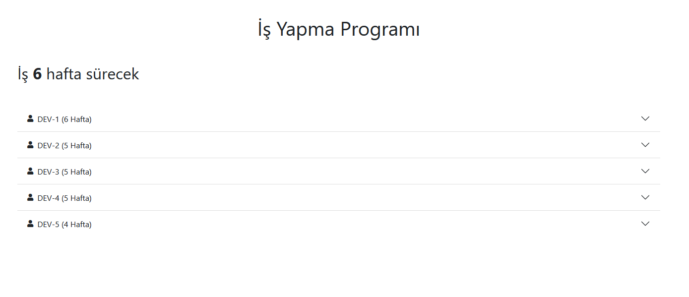
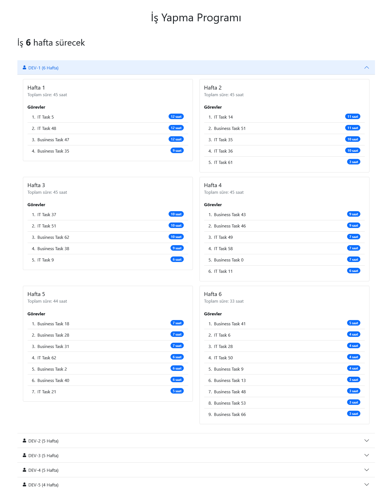

## Hakkında 

Php laravel kullanılarak API bilgileri ile iş listesini çekip, developer zorluklarına göre iş dağıtım planlamasını çıkartan örnek çalışmadır.
 
## İş Bilgilerini Almak için;  
```sh
php artisan taskprovider:fetch 
```
## Ekran Görüntüleri

 
 
